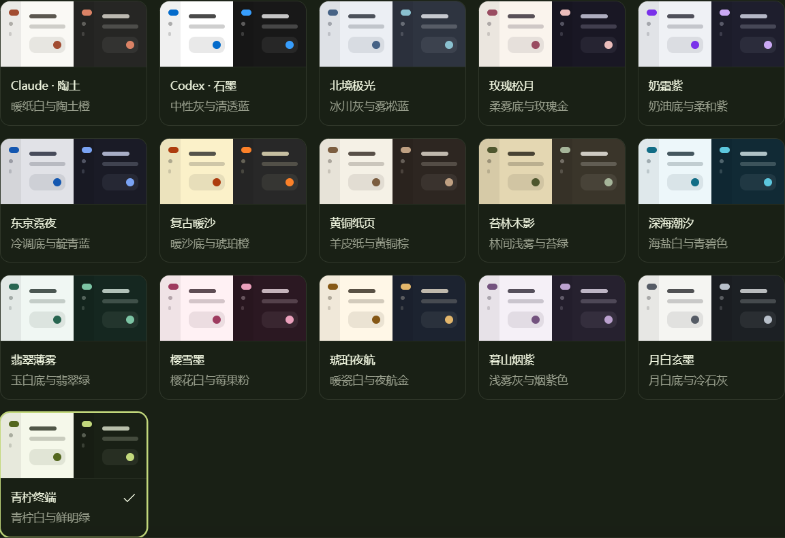

<div align="center">


# Pi-CodeLoom

让 AI 编程、项目文件与对话记录，汇聚在同一个桌面工作台。

**简体中文** · [English](./README.en.md)

[](./LICENSE)
[](https://www.electronjs.org/)
[](https://www.typescriptlang.org/)

[下载与版本](https://github.com/by-guci/Pi-CodeLoom/releases) · [问题反馈](https://github.com/by-guci/Pi-CodeLoom/issues) · [上游项目](https://github.com/justhil/pi-app)

</div>

## 项目介绍

**Pi-CodeLoom 是基于 [justhil/pi-app](https://github.com/justhil/pi-app) 二次开发的开源 AI 编程助手桌面客户端。**

本项目为非官方衍生版本，沿用上游的 Electron 桌面架构与 pi 编码助手能力，在此基础上继续完善界面、配色、对话导航和日常使用体验。感谢原作者 **justhil**、pi 项目及社区贡献者的开源贡献。

通过可配置的模型服务，Pi-CodeLoom 可以辅助阅读代码、修改文件、运行命令和查看变更。项目目录、历史会话、工具执行过程与文件预览都能在桌面界面中管理。

## 功能亮点

| 功能 | 说明 |
| --- | --- |
| 多模型与供应商配置 | 配置模型服务、切换可用模型，并选择模型支持的思考等级。 |
| 项目与会话管理 | 打开本地项目，管理历史会话、临时对话、分支与会话树。 |
| 动态对话大纲 | 左侧刻度始终居中；悬停预览提问和回复，点击定位对应轮次，滚动同步高亮。 |
| 16 套内置配色 | 每套都包含浅色与深色版本，支持跟随系统、即时预览和自定义微调。 |
| 流式回复与工具记录 | 展示 Markdown、代码、公式、思考过程和可折叠工具调用。 |
| 文件与改动审查 | 文件树、多标签预览、附件拖入、代码差异和 Git 工作区信息。 |
| 扩展与技能 | 使用 pi 扩展生态，并通过桌面适配器呈现受支持的交互和工具。 |
| 中文插件商店 | 浏览 pi.dev 官方包目录，搜索、分类、安装、检查更新和卸载用户级 npm 插件。常用插件提供中文简介，其余保留作者原文。 |
| 通知与任务状态 | 完成提醒、通知收件箱、后台任务状态及相关设置。 |
| 中英双语 | 应用界面可在中文和英文之间切换。 |

### 内置配色

在 **设置 → 外观 → 界面主题** 中选择，点击页面底部的 **保存** 保留设置。

| | | | |
| --- | --- | --- | --- |
| Claude · 陶土 | Codex · 石墨 | 北境极光 | 玫瑰松月 |
| 奶霜紫 | 东京霓夜 | 复古暖沙 | 黄铜纸页 |
| 苔林木影 | 深海潮汐 | 翡翠薄雾 | 樱雪墨 |
| 琥珀夜航 | 暮山烟紫 | 月白玄墨 | 青柠终端 |



## 安装与运行

### 下载桌面版

前往 [Releases](https://github.com/by-guci/Pi-CodeLoom/releases) 查看已发布的安装包。若暂时没有发布版本，可以按下面的方式从源码运行。

Windows 打包配置包含安装版和便携版；仓库也保留了 macOS、Linux 的打包配置。可下载的平台和版本以 Releases 实际发布内容为准。

### 从源码运行

需要 **Node.js 22.19.0 或更高版本**（推荐 Node.js 22 LTS）、npm 和 Git。

```bash
git clone https://github.com/by-guci/Pi-CodeLoom.git
cd Pi-CodeLoom
npm ci
npm run dev
```

`npm ci` 会执行项目的安装后步骤，包括原生依赖准备和构建。首次安装需要等待依赖下载完成。

开发模式退出时，退出应用并在终端按 `Ctrl+C`。若再次启动没有出现新窗口，请先通过托盘菜单退出仍在运行的旧实例。

### 首次配置

1. 在设置中确认 **Pi 运行环境**，按需使用内置、全局或独立环境。
2. 在 **模型** 等设置页配置模型供应商、模型及所需凭证。应用本身不提供模型账号或调用额度。
3. 打开一个项目文件夹，选择历史会话或新建对话。
4. 在输入区选择模型，发送消息；通过右侧面板查看文件、工具执行和代码改动。
5. 在 **外观** 中选择配色、明暗模式和图标风格。

已有的终端 pi 配置可以继续复用。pi 的模型认证、扩展和相关设置通常位于 `~/.pi/agent`；桌面偏好保存在 Electron 用户数据目录中。

### 插件商店

在 **设置 → 插件商店** 浏览官方目录，或进入“已安装”检查更新、更新／修复和卸载插件。操作即时执行，安装或更新后请彻底退出并重启应用。运行中任务会阻止安装、更新和卸载；已有版本约束会保留。中文简介由 Pi-CodeLoom 编写，可展开查看作者原文，不调用翻译服务。

当前管理范围为本机 Pi 用户环境中的 npm 包；项目级、Git 和本地路径包继续通过 Pi CLI 管理。WSL 模式支持浏览，安装与更新请在对应 WSL 终端执行。官方目录中的包由社区发布，桌面交互兼容性取决于插件及其适配器。

## 键盘快捷键

| 操作 | 快捷键或入口 |
| --- | --- |
| 发送消息 | `Enter` |
| 换行 | `Shift+Enter` |
| 停止生成 | `Esc` |
| 打开会话树 | 输入为空时连续按两次 `Esc` |
| 查看斜杠命令 | `/` |
| 添加附件 | 拖入文件、点击 `+`，或粘贴图片 |
| 对话大纲导航 | 聚焦刻度后使用 `↑`、`↓`、`Home`、`End`；`Enter` 跳转 |
| 关闭大纲预览 | `Esc` 或移开鼠标 |

## 构建与开发

**Windows 一键生成 EXE 安装包**：双击项目根目录的 [`build-exe.cmd`](./build-exe.cmd)，或在项目目录执行 `npm run package:exe`。脚本会检查环境、在缺少依赖时安装依赖、检查类型、构建源码并生成 x64 NSIS 安装包；任一步失败都会停止并显示错误。

输出文件为 `dist/Pi-CodeLoom-Setup-<版本号>-x64.exe`，同时生成 `latest.yml` 和 `.blockmap` 更新文件。脚本仅本地打包，不会自动发布或安装。需要重新安装依赖时，先运行 `npm ci`。

```bash
npm run typecheck     # TypeScript 类型检查
npm run lint          # 代码检查
npm run test:unit     # 单元与组件测试
npm run test:scripts  # 脚本及约定检查
npm run build         # 构建主进程、预加载脚本和界面
npm run test:e2e      # 桌面端端到端测试，需要先完成 build
npm run package:win   # 生成 Windows 安装版和便携版
```

打包产物输出到 `dist/`。在 macOS 或 Linux 上可使用 `npm run package` 按当前平台打包。若原生依赖出现 ABI 不匹配，可执行 `npm run rebuild:native` 后重新启动。

技术栈：**Electron 43 · React 18 · TypeScript · Vite · Tailwind CSS · Zustand · i18next · pi SDK**。

## 文档与扩展

- [中文操作指南](./doc/guide/getting-started.zh-CN.md)
- [桌面适配器列表](./doc/guide/adapters.zh-CN.md)
- [适配器编写指南](./doc/adapter-authoring-guide.md)
- [开发与贡献说明](./doc/CONTRIBUTING.md)

扩展的桌面交互支持程度取决于对应适配器，具体范围请查看适配器列表。新增模型、扩展或技能后，可能需要重新打开会话以载入配置。

## 反馈与贡献

欢迎通过 [Issues](https://github.com/by-guci/Pi-CodeLoom/issues) 提交问题或建议，也欢迎提交 Pull Request。报告问题时请附上应用版本、操作系统、复现步骤和经过脱敏的日志。

已接入 `electron-updater`：在 **设置 → 关于 → 应用更新** 中检查版本、下载更新并确认重启安装。支持启动后自动检查、下载进度、失败重试和忽略版本；便携版提供手动下载入口。首次使用需安装包含更新模块的发布版本。发布步骤与平台要求见 [版本发布与更新](./doc/RELEASING.md)。

## 致谢与许可证

- **[justhil/pi-app](https://github.com/justhil/pi-app)**：本项目直接基于其进行二次开发，感谢原作者提供的桌面客户端、扩展适配及相关基础能力。
- **[pi](https://github.com/jvm/pi-mono)**：底层编码助手与扩展生态。
- 感谢 React、Electron 及其他开源依赖的维护者和所有社区贡献者。

本项目采用 [MIT License](./LICENSE)，保留上游版权声明。Pi-CodeLoom 为独立维护的非官方衍生项目，不代表上游项目的官方发行版。
